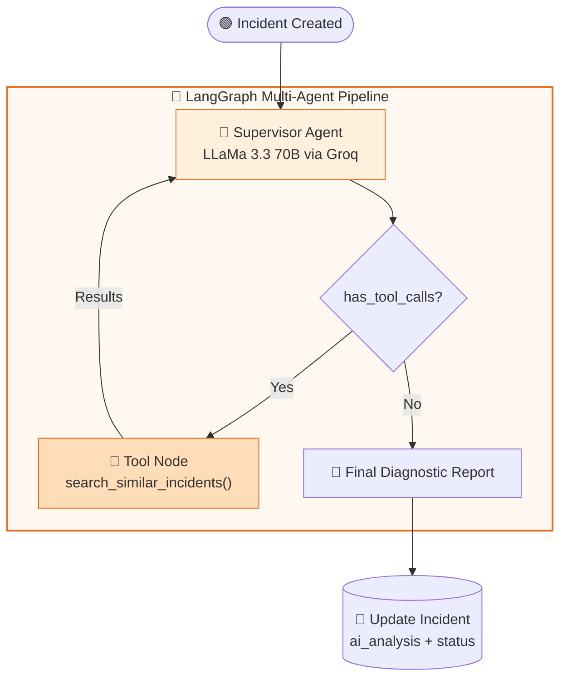
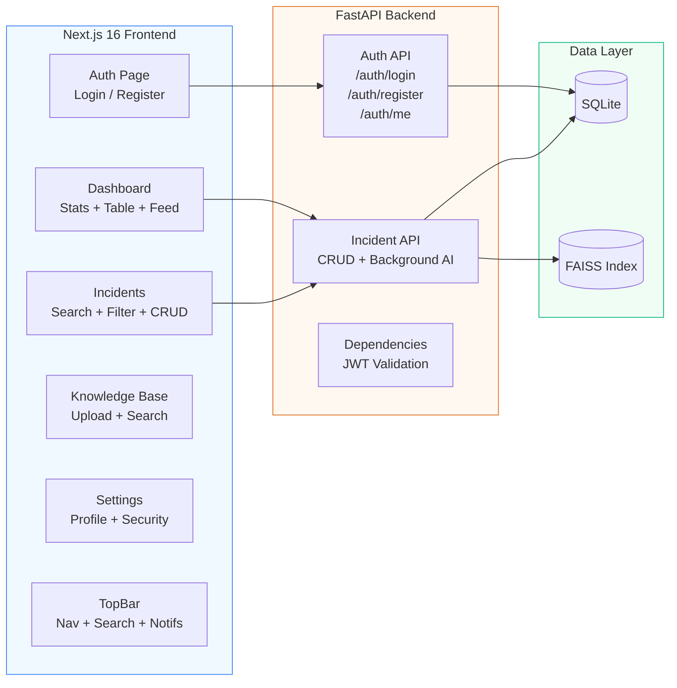

<p align="center">
  
</p>

<h1 align="center">🛡️ SentinelOps</h1>

<p align="center">
  <strong>Enterprise-Grade AI-Powered Incident Intelligence Platform</strong>
</p>

<p align="center">
  <a href="#features">Features</a> •
  <a href="#architecture">Architecture</a> •
  <a href="#tech-stack">Tech Stack</a> •
  <a href="#getting-started">Getting Started</a> •
  <a href="#api-reference">API Reference</a> •
  <a href="#system-design">System Design</a>
</p>

<p align="center">
  
  
  
  
  
  
</p>

---

## 🚀 Overview

**SentinelOps** is a production-ready, full-stack incident management platform that leverages **autonomous AI agents** to diagnose, investigate, and resolve infrastructure incidents in real-time. Built with a modern decoupled architecture, it combines a high-performance FastAPI backend with a premium Next.js frontend and a LangGraph-powered multi-agent intelligence pipeline.

When an incident is reported, SentinelOps automatically triggers a background AI analysis pipeline that:
1. Searches historical incidents using **semantic vector search** (FAISS + HuggingFace embeddings)
2. Generates a comprehensive **root cause analysis** using LLaMa 3.3 70B via Groq Cloud
3. Provides **actionable recommendations** for incident resolution

---

## ✨ Features

### Core Platform
| Feature | Description |
|---------|-------------|
| 🔐 **Enterprise Authentication** | JWT-based auth with bcrypt password hashing, RBAC, and session management |
| 📊 **Real-time Dashboard** | Live stats, recent incidents table, activity feed, and AI capabilities overview |
| 🎫 **Incident Management** | Full CRUD with severity/status tracking, search, and advanced filtering |
| 🔔 **Smart Notifications** | Interactive notification panel with real-time incident alerts and dismiss actions |
| 🔍 **Global Command Palette** | Ctrl+K / ⌘K powered search across all incidents with instant results |
| 📚 **Knowledge Base** | Document upload interface for runbooks, SOPs, and log files |
| ⚙️ **Settings Dashboard** | Profile management, security overview, notifications config, integrations status |

### AI Intelligence
| Feature | Description |
|---------|-------------|
| 🤖 **Autonomous Investigation** | LangGraph multi-agent system with supervisor + tool nodes |
| 🧠 **LLM-Powered Analysis** | LLaMa 3.3 70B via Groq Cloud for expert-level incident diagnosis |
| 📑 **Vector Retrieval** | FAISS-based semantic search over historical incidents and knowledge base |
| ⚡ **Background Processing** | Non-blocking AI analysis via FastAPI BackgroundTasks |
| 🔄 **Auto-Status Updates** | Incidents automatically transition to "investigating" when AI analysis completes |

### UX / Design
| Feature | Description |
|---------|-------------|
| 🎨 **Premium UI** | Glassmorphism effects, gradient accents, and curated color palette |
| ✨ **Micro-animations** | Framer Motion powered transitions, hover effects, and layout animations |
| 📱 **Responsive Design** | Mobile-first approach with adaptive layouts |
| ⌨️ **Keyboard Navigation** | Full keyboard shortcut support (⌘K search, Escape to close) |
| 🕐 **Accurate Timestamps** | UTC-aware relative time display ("just now", "5m ago", "2h ago") |

---

## 🏗️ Architecture

### High-Level Design (HLD)

<p align="center">
  
</p>

SentinelOps follows a **three-tier decoupled architecture**:

```
┌─────────────────────────────────────────────────────────┐
│  PRESENTATION    Next.js 16 + React 19 + TanStack Query │
├─────────────────────────────────────────────────────────┤
│  APPLICATION     FastAPI + LangGraph + Groq AI          │
├─────────────────────────────────────────────────────────┤
│  DATA            SQLite + FAISS Vector Store             │
└─────────────────────────────────────────────────────────┘
```

### Low-Level Design (LLD)

<p align="center">
  
</p>

### System Design — Request Flow

<p align="center">
  
</p>

### AI Agent Pipeline (LangGraph State Machine)



### Component Architecture



---

## 🛠️ Tech Stack

### Backend

| Technology | Version | Purpose |
|-----------|---------|---------|
| **Python** | 3.11+ | Runtime |
| **FastAPI** | 0.111+ | ASGI web framework |
| **Uvicorn** | 0.30+ | ASGI server |
| **SQLAlchemy** | 2.0+ | Async ORM |
| **aiosqlite** | 0.20+ | Async SQLite driver |
| **Alembic** | 1.13+ | Database migrations |
| **Pydantic** | 2.7+ | Data validation & serialization |
| **python-jose** | 3.3+ | JWT token handling |
| **passlib + bcrypt** | — | Password hashing |
| **LangGraph** | 0.1+ | Multi-agent orchestration |
| **LangChain** | 0.2+ | LLM framework |
| **langchain-groq** | 0.1+ | Groq LLM integration |
| **FAISS** | 1.8+ | Vector similarity search |
| **HuggingFace** | — | Embedding models (BGE-M3) |

### Frontend

| Technology | Version | Purpose |
|-----------|---------|---------|
| **Next.js** | 16.2 | React meta-framework (Turbopack) |
| **React** | 19.2 | UI library |
| **TypeScript** | 5+ | Type safety |
| **TanStack Query** | 5+ | Server state management |
| **Framer Motion** | 12+ | Animations & transitions |
| **Tailwind CSS** | 4+ | Utility-first styling |
| **shadcn/ui (base-ui)** | — | Component library |
| **react-hook-form** | 7+ | Form management |
| **Zod** | 4+ | Schema validation |
| **Lucide React** | 1+ | Icon library |

---

## 🏃 Getting Started

### Prerequisites

- **Python 3.11+** with pip
- **Node.js 18+** with npm
- **Groq API Key** (free at [console.groq.com](https://console.groq.com))

### 1. Clone & Configure

```bash
git clone https://github.com/your-repo/sentinelops.git
cd sentinelops
```

### 2. Backend Setup

```bash
cd backend

# Create virtual environment
python -m venv venv
source venv/bin/activate  # On Windows: .\venv\Scripts\activate

# Install dependencies
pip install -r requirements.txt
pip install sentence-transformers  # Required for embeddings

# Configure environment
cp .env.example .env
# Edit .env and add your GROQ_API_KEY
```

**`.env` Configuration:**

```env
PROJECT_NAME="SentinelOps"
SQLITE_DB_PATH="sqlite.db"
GROQ_API_KEY="gsk_your_groq_api_key_here"
SECRET_KEY=your_secret_key_here
```

### 3. Frontend Setup

```bash
cd frontend

# Install dependencies
npm install
```

### 4. Run the Application

**Terminal 1 — Backend (port 8000):**
```bash
cd backend
.\venv\Scripts\python.exe -m uvicorn app.main:app --host 0.0.0.0 --port 8000 --reload
```

**Terminal 2 — Frontend (port 3000):**
```bash
cd frontend
npm run dev
```

### 5. Access the Platform

- **Frontend:** [http://localhost:3000](http://localhost:3000)
- **Backend API:** [http://localhost:8000](http://localhost:8000)
- **API Docs (Swagger):** [http://localhost:8000/api/v1/openapi.json](http://localhost:8000/api/v1/openapi.json)
- **Health Check:** [http://localhost:8000/health](http://localhost:8000/health)

---

## 📡 API Reference

### Authentication

| Method | Endpoint | Description | Auth |
|--------|----------|-------------|------|
| `POST` | `/api/v1/auth/login` | OAuth2 token login | ❌ |
| `POST` | `/api/v1/auth/register` | Create new user | ❌ |
| `GET`  | `/api/v1/auth/me` | Get current user | ✅ |

### Incidents

| Method | Endpoint | Description | Auth |
|--------|----------|-------------|------|
| `POST` | `/api/v1/incidents/` | Create incident + trigger AI | ✅ |
| `GET`  | `/api/v1/incidents/` | List all incidents | ✅ |
| `GET`  | `/api/v1/incidents/{id}` | Get incident by ID | ✅ |

### Example: Create Incident

```bash
curl -X POST http://localhost:8000/api/v1/incidents/ \
  -H "Authorization: Bearer YOUR_TOKEN" \
  -H "Content-Type: application/json" \
  -d '{
    "title": "Production API Gateway Timeout",
    "description": "Multiple services experiencing 504 timeout errors.",
    "severity": "critical"
  }'
```

### Response Schema

```json
{
  "id": "550e8400-e29b-41d4-a716-446655440000",
  "title": "Production API Gateway Timeout",
  "description": "Multiple services experiencing 504 timeout errors.",
  "status": "investigating",
  "severity": "critical",
  "ai_analysis": "## Root Cause Hypothesis\n\nBased on analysis...",
  "created_at": "2026-07-13T09:30:00Z",
  "updated_at": "2026-07-13T09:35:12Z"
}
```

---

## 📐 System Design

> 📄 **Full system design documentation is available in [`docs/SYSTEM_DESIGN.md`](docs/SYSTEM_DESIGN.md)**

### Key Design Decisions

| Decision | Rationale |
|----------|-----------|
| **SQLite over PostgreSQL** | Zero-config dev setup; easily swappable for production |
| **FAISS over Qdrant/Pinecone** | Local-first, no external service dependency |
| **BackgroundTasks over Celery** | Lightweight; sufficient for single-server deployment |
| **JWT over Session** | Stateless auth; horizontal scalability |
| **LangGraph over raw LangChain** | Structured state machine with built-in tool loop |
| **Groq over OpenAI** | Ultra-fast inference (< 1s for 70B model) |
| **base-ui over Radix** | shadcn v4 default; React 19 compatible |

### Database ER Diagram

```
┌─────────────────────┐        ┌─────────────────────────┐
│       USER          │        │       INCIDENT           │
├─────────────────────┤        ├─────────────────────────┤
│ PK  id (UUID)       │        │ PK  id (UUID)            │
│     email (UNIQUE)  │        │ IDX title                │
│     hashed_password │        │     description          │
│     full_name       │        │ IDX status               │
│     is_active       │        │ IDX severity             │
│     is_superuser    │        │     ai_analysis          │
│     created_at (UTC)│        │     created_at (UTC)     │
│     updated_at (UTC)│        │     updated_at (UTC)     │
└─────────────────────┘        └─────────────────────────┘
```

### Security Architecture

```
Client → CORS Policy → JWT Guard → Route Handler → Pydantic Validation → Database
  │                       │
  │                     bcrypt
  │                    (passwords)
  ▼
localStorage (token)
```

---

## 📁 Project Structure

```
sentinelops/
├── backend/
│   ├── app/
│   │   ├── main.py              # FastAPI app factory
│   │   ├── core/
│   │   │   ├── config.py        # Environment settings
│   │   │   ├── security.py      # JWT + bcrypt utilities
│   │   │   ├── llm.py           # Groq LLM factory
│   │   │   └── vectorstore.py   # FAISS manager
│   │   ├── api/
│   │   │   ├── deps.py          # Auth dependencies
│   │   │   └── v1/
│   │   │       ├── auth.py      # Auth endpoints
│   │   │       └── incidents.py # Incident CRUD + AI
│   │   ├── models/
│   │   │   ├── base.py          # SQLAlchemy base
│   │   │   ├── user.py          # User model
│   │   │   └── incident.py      # Incident model
│   │   ├── schemas/             # Pydantic schemas
│   │   ├── agents/
│   │   │   ├── graph.py         # LangGraph pipeline
│   │   │   └── tools.py         # FAISS search tool
│   │   └── db/
│   │       └── session.py       # Async DB engine
│   ├── faiss_index/             # Vector store data
│   ├── requirements.txt
│   └── .env
│
├── frontend/
│   ├── src/
│   │   ├── app/
│   │   │   ├── page.tsx         # Auth (login/register)
│   │   │   ├── layout.tsx       # Root layout + metadata
│   │   │   ├── providers.tsx    # QueryClient + Auth
│   │   │   └── (dashboard)/
│   │   │       ├── layout.tsx   # Protected layout
│   │   │       ├── dashboard/   # Main dashboard
│   │   │       ├── incidents/   # Incident management
│   │   │       ├── knowledge/   # Knowledge base
│   │   │       └── settings/    # User settings
│   │   ├── components/
│   │   │   ├── layout/          # TopBar (nav, search, notifs)
│   │   │   ├── dashboard/       # StatCard, IncidentTable, ActivityFeed
│   │   │   ├── incidents/       # CreateIncidentDialog
│   │   │   └── ui/              # shadcn primitives
│   │   └── lib/
│   │       ├── api.ts           # API client
│   │       ├── auth-context.tsx # Auth state
│   │       └── utils.ts         # Utilities
│   ├── package.json
│   └── next.config.ts
│
└── docs/
    ├── SYSTEM_DESIGN.md         # Full architecture docs
    └── diagrams/
        ├── hld_architecture.png # High-Level Design
        ├── lld_design.png       # Low-Level Design
        └── system_design_flow.png # System flow diagram
```

---

## 🔮 Roadmap

| Phase | Feature | Status |
|-------|---------|--------|
| ✅ Phase 1 | Core backend (FastAPI + SQLAlchemy + JWT) | Complete |
| ✅ Phase 2 | Frontend dashboard (Next.js + React 19) | Complete |
| ✅ Phase 3 | AI agent pipeline (LangGraph + Groq) | Complete |
| ✅ Phase 4 | Notifications, search, and UX polish | Complete |
| 🔜 Phase 5 | Knowledge base upload + vector indexing | In Progress |
| 📋 Phase 6 | Email/Slack webhook notifications | Planned |
| 📋 Phase 7 | PostgreSQL migration + Redis caching | Planned |
| 📋 Phase 8 | Docker Compose + CI/CD pipeline | Planned |
| 📋 Phase 9 | Multi-tenant RBAC + team management | Planned |

---

## 📄 License

This project is licensed under the MIT License — see the [LICENSE](LICENSE) file for details.

---

<p align="center">
  Built with ❤️ using <strong>FastAPI</strong>, <strong>Next.js</strong>, <strong>LangGraph</strong>, and <strong>Groq AI</strong>
</p>
