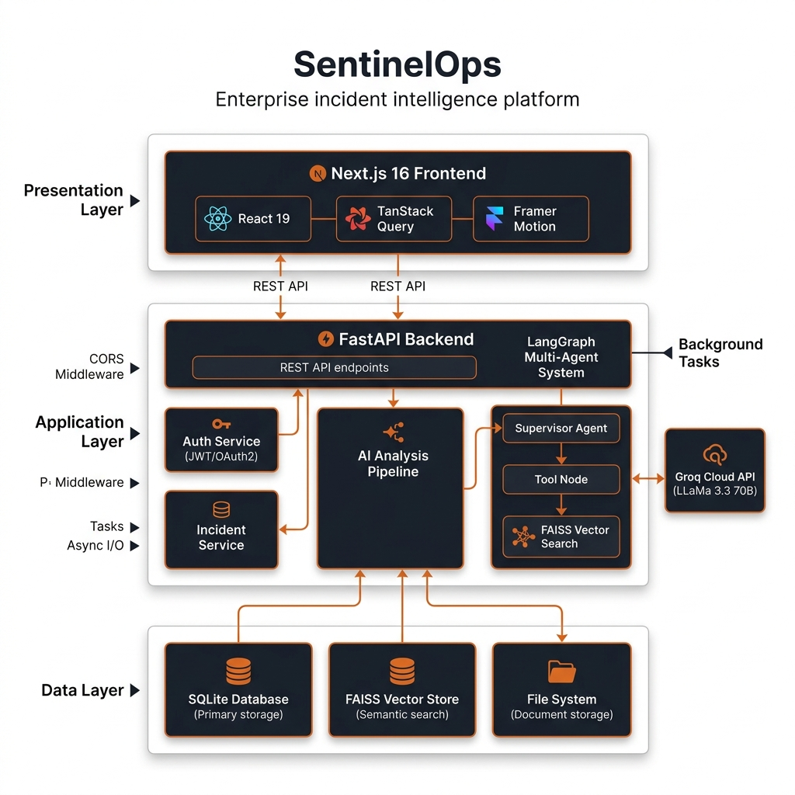
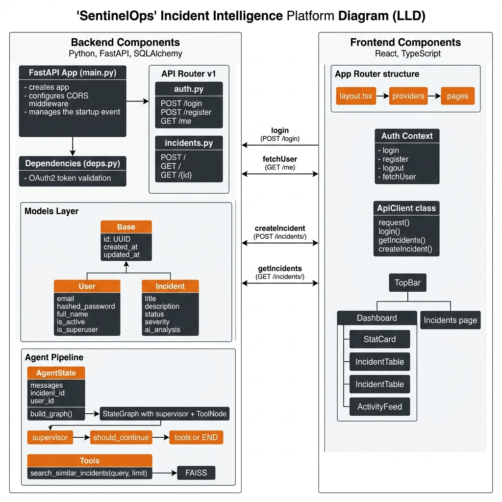
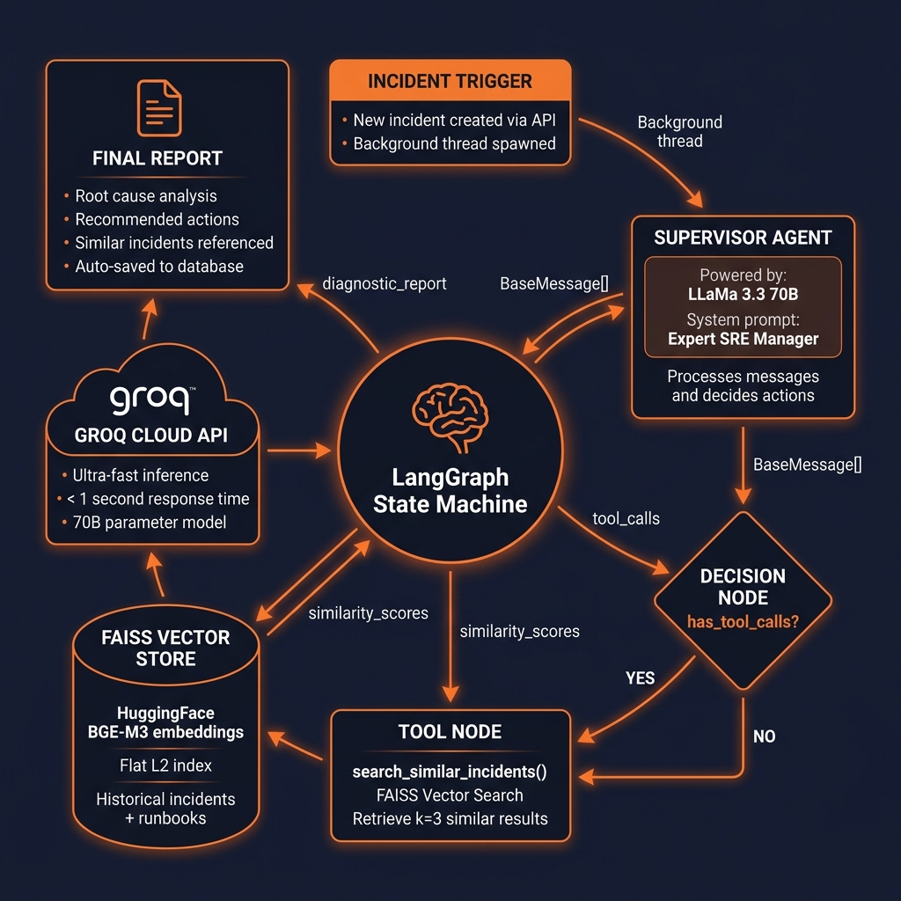
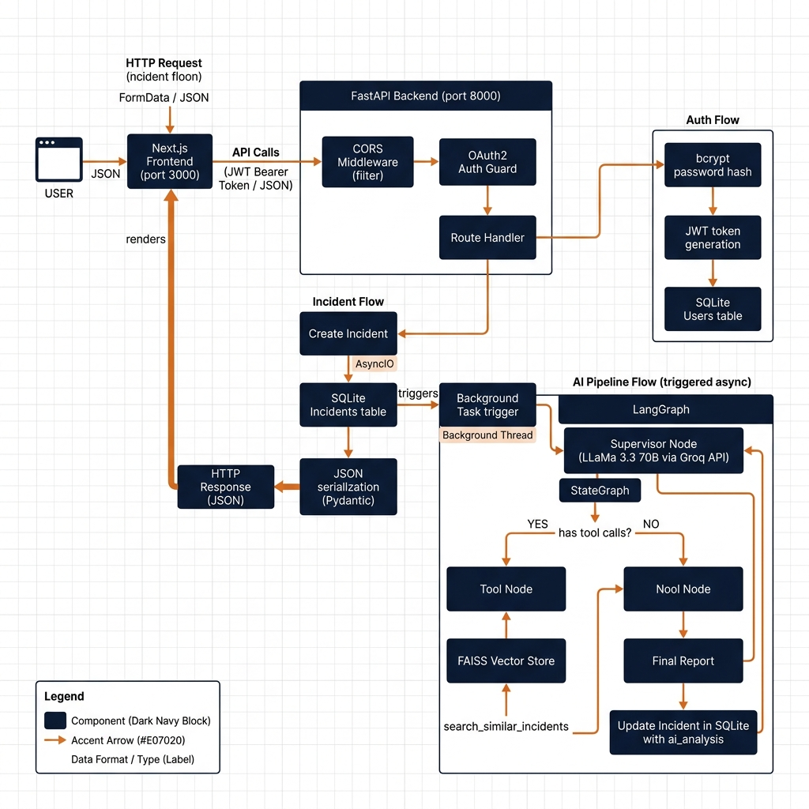
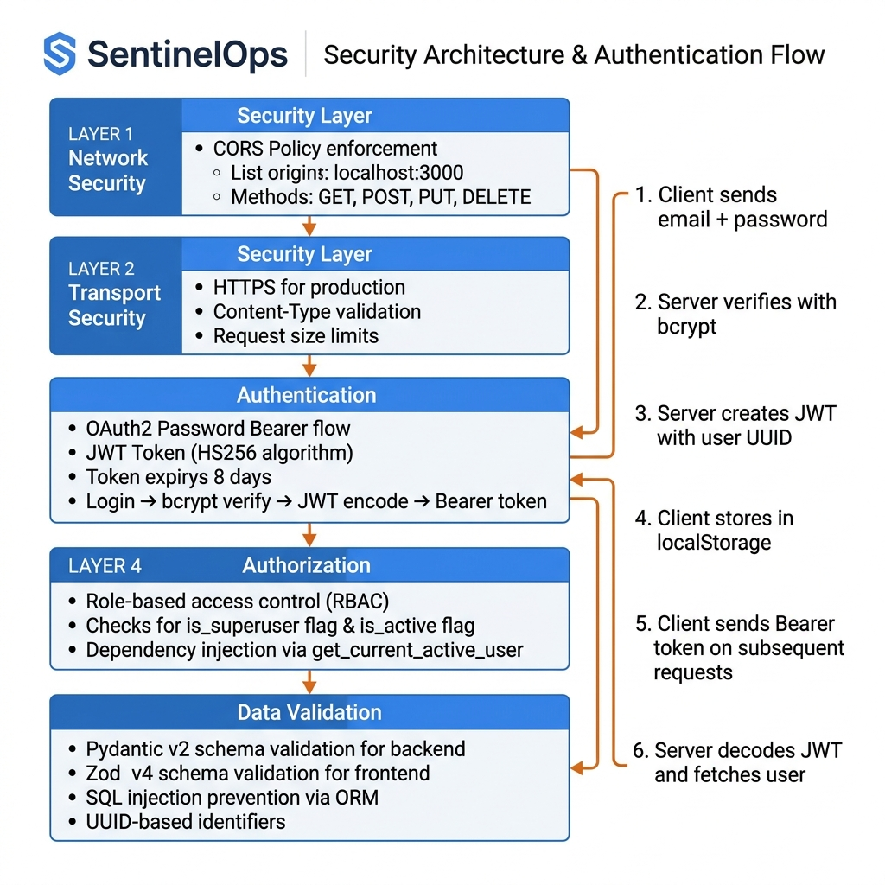
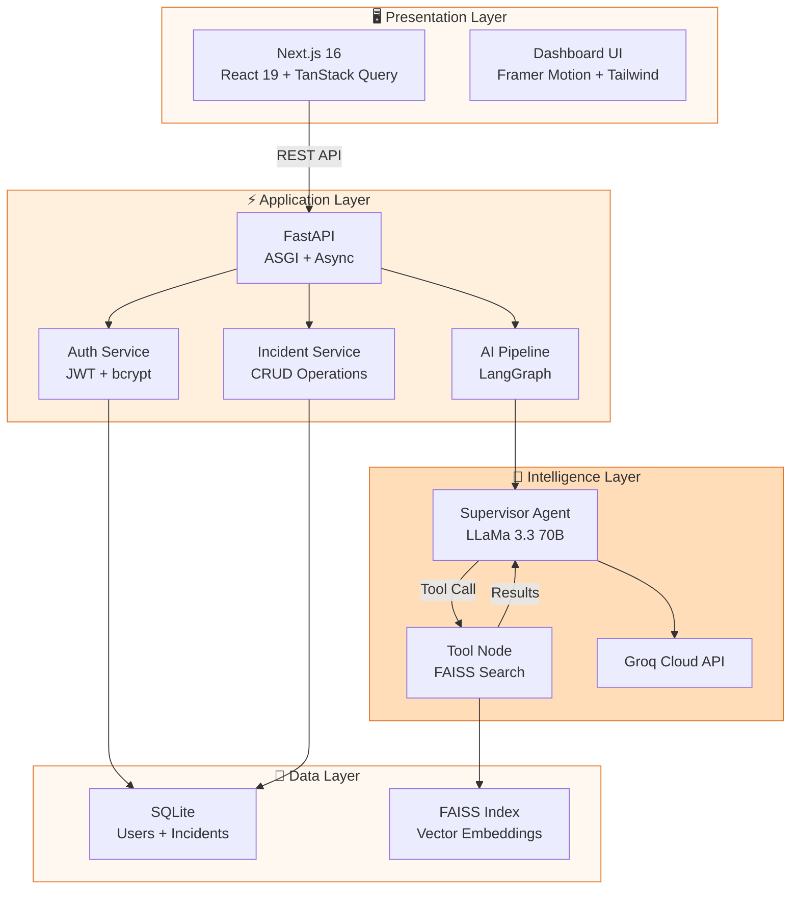

# SentinelOps — Advanced System Design & Architecture

> **SentinelOps** is an enterprise-grade, AI-powered incident intelligence platform that leverages autonomous multi-agent systems to diagnose, investigate, and resolve infrastructure incidents in real-time.

---

## Table of Contents

1. [System Overview](#system-overview)
2. [High-Level Design (HLD)](#high-level-design-hld)
3. [Low-Level Design (LLD)](#low-level-design-lld)
4. [AI Agent Pipeline Architecture](#ai-agent-pipeline-architecture)
5. [Data Flow & Sequence Diagrams](#data-flow--sequence-diagrams)
6. [Database Design](#database-design)
7. [Security Architecture](#security-architecture)
8. [Frontend Architecture](#frontend-architecture)
9. [API Contract Specification](#api-contract-specification)
10. [Deployment Architecture](#deployment-architecture)
11. [AI Prompt for Diagram Generation](#ai-prompt-for-diagram-generation)

---

## System Overview

SentinelOps is built on a modern **decoupled full-stack architecture** with three core tiers:

| Layer | Technology | Purpose |
|-------|-----------|---------|
| **Presentation** | Next.js 16 + React 19 | Rich interactive dashboard UI |
| **Application** | FastAPI (Python) | REST API, auth, business logic |
| **Intelligence** | LangGraph + Groq (LLaMa 3.3 70B) | Autonomous incident diagnosis |
| **Data** | SQLite + FAISS | Persistent storage + vector search |

### Key Capabilities

- 🔐 **JWT Authentication** with bcrypt password hashing
- 🤖 **Autonomous AI Investigation** via LangGraph multi-agent pipeline
- 🔍 **Semantic Search** using FAISS vector store with HuggingFace embeddings
- 📊 **Real-time Dashboard** with live incident tracking and activity feeds
- 🔔 **Smart Notifications** with dismissible incident alerts
- ⌨️ **Command Palette Search** (Ctrl+K / ⌘K) with fuzzy matching

---

## High-Level Design (HLD)

### Architecture Block Diagram



### Three-Tier Architecture Breakdown

```
┌─────────────────────────────────────────────────────────────────────┐
│                      PRESENTATION LAYER                            │
│  ┌───────────────────────────────────────────────────────────────┐  │
│  │  Next.js 16 (Turbopack)  │  React 19  │  TanStack Query v5   │  │
│  │  Framer Motion          │  Zod v4    │  React Hook Form      │  │
│  │  Tailwind CSS v4        │  Lucide    │  shadcn/base-ui       │  │
│  └───────────────────────────────────────────────────────────────┘  │
│                              │ REST API (JSON)                      │
│                              ▼                                      │
├─────────────────────────────────────────────────────────────────────┤
│                      APPLICATION LAYER                              │
│  ┌─────────────┐  ┌──────────────┐  ┌──────────────────────────┐  │
│  │ Auth Service │  │  Incident    │  │  AI Analysis Pipeline    │  │
│  │ (JWT/OAuth2) │  │  Service     │  │  (LangGraph + Groq)     │  │
│  │ ┌─────────┐ │  │ ┌──────────┐ │  │ ┌────────────────────┐  │  │
│  │ │ bcrypt   │ │  │ │ CRUD     │ │  │ │ Supervisor Agent   │  │  │
│  │ │ hashing  │ │  │ │ Ops      │ │  │ │ (LLaMa 3.3 70B)   │  │  │
│  │ └─────────┘ │  │ └──────────┘ │  │ ├────────────────────┤  │  │
│  └─────────────┘  └──────────────┘  │ │ Tool Node          │  │  │
│                                      │ │ (FAISS Search)     │  │  │
│  ┌──────────────────────────────┐   │ └────────────────────┘  │  │
│  │ FastAPI Framework            │   └──────────────────────────┘  │
│  │ • CORS Middleware            │                                  │
│  │ • Background Tasks (threads) │                                  │
│  │ • Pydantic Serialization     │                                  │
│  │ • AsyncIO Engine             │                                  │
│  └──────────────────────────────┘                                  │
│                              │                                      │
│                              ▼                                      │
├─────────────────────────────────────────────────────────────────────┤
│                         DATA LAYER                                  │
│  ┌─────────────┐  ┌──────────────┐  ┌──────────────────────────┐  │
│  │ SQLite DB    │  │ FAISS Vector │  │ File System              │  │
│  │ (aiosqlite)  │  │ Store (CPU)  │  │ (Documents/Knowledge)    │  │
│  │ • Users      │  │ • Embeddings │  │ • Uploaded PDFs          │  │
│  │ • Incidents  │  │ • BGE-M3     │  │ • Runbooks               │  │
│  └─────────────┘  └──────────────┘  └──────────────────────────┘  │
└─────────────────────────────────────────────────────────────────────┘
```

### External Service Dependencies

| Service | Purpose | Model/Version |
|---------|---------|---------------|
| **Groq Cloud** | LLM inference API | LLaMa 3.3 70B |
| **HuggingFace** | Embedding models | BGE-M3 / all-MiniLM-L6-v2 |
| **FAISS** | Vector similarity search | faiss-cpu 1.8+ |

---

## Low-Level Design (LLD)

### Component Interaction Diagram



### Backend Module Architecture

```
backend/
├── app/
│   ├── main.py                    # FastAPI app factory + startup
│   ├── core/
│   │   ├── config.py              # Pydantic settings (env-driven)
│   │   ├── security.py            # JWT creation + bcrypt utils
│   │   ├── llm.py                 # Groq LLM client factory
│   │   └── vectorstore.py         # FAISS vector store manager
│   ├── api/
│   │   ├── deps.py                # OAuth2 dependency injection
│   │   └── v1/
│   │       ├── api.py             # API router aggregator
│   │       ├── auth.py            # POST /login, /register, GET /me
│   │       └── incidents.py       # CRUD + background AI analysis
│   ├── models/
│   │   ├── base.py                # SQLAlchemy declarative base
│   │   ├── user.py                # User ORM model
│   │   └── incident.py            # Incident ORM model
│   ├── schemas/
│   │   ├── user.py                # Pydantic user schemas
│   │   ├── incident.py            # Pydantic incident schemas
│   │   └── token.py               # JWT token response schema
│   ├── agents/
│   │   ├── graph.py               # LangGraph multi-agent graph
│   │   ├── tools.py               # FAISS search tool for agents
│   │   └── memory/                # Agent memory persistence
│   ├── db/
│   │   ├── session.py             # Async SQLAlchemy engine
│   │   └── migrations/            # Alembic migration scripts
│   └── services/                  # Business logic (extensible)
├── faiss_index/                   # Persisted FAISS vector indices
├── requirements.txt               # Python dependencies
├── alembic.ini                    # Migration configuration
└── .env                           # Environment variables
```

### Class Diagrams

#### Backend Domain Models

```
┌──────────────────────────────────┐
│            Base (Abstract)        │
├──────────────────────────────────┤
│ + id: UUID (PK, auto)            │
│ + created_at: datetime (UTC)     │
│ + updated_at: datetime (UTC)     │
├──────────────────────────────────┤
│ + __tablename__: auto-generated  │
└────────────┬─────────────────────┘
             │ extends
    ┌────────┴────────┐
    ▼                 ▼
┌──────────────┐  ┌──────────────────────────┐
│    User      │  │       Incident            │
├──────────────┤  ├──────────────────────────┤
│ email: str   │  │ title: str (indexed)      │
│ hashed_pwd   │  │ description: text|null    │
│ full_name    │  │ status: str (indexed)     │
│ is_active    │  │   "open"|"investigating"  │
│ is_superuser │  │   "resolved"|"closed"     │
└──────────────┘  │ severity: str (indexed)   │
                  │   "low"|"medium"|"high"   │
                  │   "critical"              │
                  │ ai_analysis: text|null    │
                  └──────────────────────────┘
```

#### Frontend Component Tree

```
RootLayout (layout.tsx)
  └─ Providers (QueryClient + AuthProvider)
     ├─ AuthPage (page.tsx — login/register)
     │   ├─ LoginForm (react-hook-form + zod)
     │   └─ RegisterForm (react-hook-form + zod)
     │
     └─ DashboardLayout ((dashboard)/layout.tsx)
         ├─ TopBar
         │   ├─ Brand Navigation (SentinelOps)
         │   ├─ NavLinks (Dashboard, Incidents, Knowledge, Settings)
         │   ├─ GlobalSearchModal (Ctrl+K)
         │   ├─ NotificationPanel (live incident alerts)
         │   └─ UserDropdownMenu (profile, settings, logout)
         │
         ├─ DashboardPage
         │   ├─ StatCard × 4 (total, open, resolved, critical)
         │   ├─ IncidentTable (recent incidents with links)
         │   ├─ ActivityFeed (real-time timeline)
         │   └─ AICapabilitiesCard (stack overview)
         │
         ├─ IncidentsPage
         │   ├─ SearchInput (filtered search)
         │   ├─ FilterDropdowns (severity, status)
         │   ├─ IncidentCards (expandable list)
         │   └─ CreateIncidentDialog (form + validation)
         │
         ├─ KnowledgePage
         │   ├─ SemanticSearchInput
         │   └─ DocumentUpload (PDF, Markdown, Logs)
         │
         └─ SettingsPage
             ├─ ProfileTab (user info display)
             ├─ SecurityTab (auth status)
             ├─ NotificationsTab (coming soon)
             └─ IntegrationsTab (connected services)
```

---

## AI Agent Pipeline Architecture

### LangGraph State Machine

The heart of SentinelOps is a **LangGraph-powered multi-agent system** that autonomously diagnoses incidents.

```
                    ┌─────────────────────┐
                    │     START            │
                    └──────────┬──────────┘
                               │
                               ▼
                    ┌─────────────────────┐
                    │  SUPERVISOR AGENT   │
                    │  (LLaMa 3.3 70B)   │
                    │                     │
                    │  System Prompt:     │
                    │  "Expert SRE        │
                    │   incident manager" │
                    └──────────┬──────────┘
                               │
                    ┌──────────▼──────────┐
                    │  should_continue()  │
                    │  Decision Node      │
                    └──────────┬──────────┘
                          ┌────┴────┐
                          │         │
                    has_tools?  no_tools?
                          │         │
                          ▼         ▼
               ┌──────────────┐  ┌─────┐
               │  TOOL NODE   │  │ END │
               │              │  └─────┘
               │ Executes:    │
               │ search_      │
               │ similar_     │
               │ incidents()  │
               └──────┬───────┘
                      │
                      │  results
                      │
                      ▼
               ┌──────────────┐
               │  Back to     │
               │  SUPERVISOR  │──────→ (loop until no tools needed)
               └──────────────┘
```

### Agent State Schema

```python
class AgentState(TypedDict):
    messages: Annotated[Sequence[BaseMessage], operator.add]  # Chat history
    incident_id: str                                           # Tracking ID
    user_id: str                                               # Originator
```

### AI Pipeline Visual Architecture



### Vector Search Tool

```python
@tool
def search_similar_incidents(query: str, limit: int = 3) -> str:
    """
    FAISS semantic search over historical incidents and runbooks.
    
    Input:  Natural language query (incident description)
    Output: Top-K similar documents with metadata
    
    Embedding Model: HuggingFace BGE-M3
    Index Type:      FAISS Flat L2
    Storage:         /faiss_index/ directory
    """
```

---

## Data Flow & Sequence Diagrams

### System Design Flow



### Incident Creation → AI Analysis Lifecycle

```
User                    Frontend              Backend API           LangGraph           Database
 │                         │                      │                    │                   │
 │  Fill form & submit     │                      │                    │                   │
 │ ──────────────────────► │                      │                    │                   │
 │                         │  POST /incidents/    │                    │                   │
 │                         │ ───────────────────► │                    │                   │
 │                         │                      │  INSERT incident   │                   │
 │                         │                      │ ──────────────────────────────────────► │
 │                         │                      │                    │                   │
 │                         │                      │  Spawn Background  │                   │
 │                         │                      │  Task (thread)     │                   │
 │                         │                      │ ─────────────────► │                   │
 │                         │  201 Created (JSON)  │                    │                   │
 │                         │ ◄─────────────────── │                    │                   │
 │  Incident appears on    │                      │                    │                   │
 │  dashboard              │                      │                    │                   │
 │ ◄────────────────────── │                      │                    │                   │
 │                         │                      │                    │                   │
 │                         │                      │      ┌─────────────┤ (async)           │
 │                         │                      │      │ build_graph()                    │
 │                         │                      │      │ invoke()     │                   │
 │                         │                      │      │              │                   │
 │                         │                      │      │ Supervisor → │                   │
 │                         │                      │      │ Groq API     │                   │
 │                         │                      │      │ (LLaMa 3.3) │                   │
 │                         │                      │      │              │                   │
 │                         │                      │      │ Tool call → FAISS search         │
 │                         │                      │      │ Results     │                    │
 │                         │                      │      │              │                   │
 │                         │                      │      │ Final report │                   │
 │                         │                      │      └──────────────┤                   │
 │                         │                      │                    │  UPDATE incident   │
 │                         │                      │                    │  SET ai_analysis   │
 │                         │                      │                    │  SET status =      │
 │                         │                      │                    │  "investigating"   │
 │                         │                      │                    │ ────────────────► │
 │                         │                      │                    │                   │
 │  Poll / refresh sees    │  GET /incidents/{id} │                    │                   │
 │  AI analysis complete   │ ───────────────────► │                    │                   │
 │ ◄────────────────────── │ ◄─────────────────── │                    │                   │
```

### Authentication Flow

```
User                    Frontend              Backend API           Database
 │                         │                      │                   │
 │  Enter email/password   │                      │                   │
 │ ──────────────────────► │                      │                   │
 │                         │  POST /auth/login    │                   │
 │                         │  (form-urlencoded)   │                   │
 │                         │ ───────────────────► │                   │
 │                         │                      │  SELECT user      │
 │                         │                      │  WHERE email=?    │
 │                         │                      │ ────────────────► │
 │                         │                      │ ◄──── user row    │
 │                         │                      │                   │
 │                         │                      │  bcrypt.verify()  │
 │                         │                      │  jwt.encode()     │
 │                         │                      │                   │
 │                         │  { access_token }    │                   │
 │                         │ ◄─────────────────── │                   │
 │                         │                      │                   │
 │                         │  Store in            │                   │
 │                         │  localStorage        │                   │
 │                         │                      │                   │
 │                         │  GET /auth/me         │                   │
 │                         │  Authorization:       │                   │
 │                         │  Bearer <token>       │                   │
 │                         │ ───────────────────► │                   │
 │                         │                      │  jwt.decode()     │
 │                         │                      │  SELECT user      │
 │                         │  { user object }     │                   │
 │  Redirect to dashboard  │ ◄─────────────────── │                   │
 │ ◄────────────────────── │                      │                   │
```

---

## Database Design

### Entity-Relationship Diagram

```
                    ┌────────────────────────────────────┐
                    │              USER                   │
                    ├────────────────────────────────────┤
                    │ PK  id           UUID               │
                    │     email        VARCHAR(255) UNIQUE │
                    │     hashed_pwd   VARCHAR(255)        │
                    │     full_name    VARCHAR(255) NULL    │
                    │     is_active    BOOLEAN DEFAULT TRUE │
                    │     is_superuser BOOLEAN DEFAULT FALSE│
                    │     created_at   DATETIME (UTC)      │
                    │     updated_at   DATETIME (UTC)      │
                    └────────────────────────────────────┘

                    ┌────────────────────────────────────┐
                    │            INCIDENT                 │
                    ├────────────────────────────────────┤
                    │ PK  id           UUID               │
                    │ IDX title        VARCHAR(255)        │
                    │     description  TEXT NULL            │
                    │ IDX status       VARCHAR(50)         │
                    │ IDX severity     VARCHAR(50)         │
                    │     ai_analysis  TEXT NULL            │
                    │     created_at   DATETIME (UTC)      │
                    │     updated_at   DATETIME (UTC)      │
                    └────────────────────────────────────┘
```

### Index Strategy

| Table | Column | Index Type | Purpose |
|-------|--------|-----------|---------|
| user | email | UNIQUE | Login lookup |
| incident | title | B-TREE | Text search |
| incident | status | B-TREE | Filter queries |
| incident | severity | B-TREE | Filter queries |

---

## Security Architecture

### Security Layer Diagram



### Security Layers Detail

```
┌─────────────────────────────────────────────────────────────┐
│                    SECURITY LAYERS                           │
│                                                             │
│  ┌────────────────────────────────────────────────────────┐ │
│  │ Layer 1: CORS Policy                                   │ │
│  │ • Explicit origins: localhost:3000, 127.0.0.1:3000    │ │
│  │ • Credentials: allowed                                 │ │
│  │ • Methods: all                                         │ │
│  └────────────────────────────────────────────────────────┘ │
│                                                             │
│  ┌────────────────────────────────────────────────────────┐ │
│  │ Layer 2: JWT Authentication                            │ │
│  │ • Algorithm: HS256                                     │ │
│  │ • Token expiry: 8 days (configurable)                 │ │
│  │ • Payload: { sub: user_uuid }                         │ │
│  │ • Transport: Authorization: Bearer <token>            │ │
│  └────────────────────────────────────────────────────────┘ │
│                                                             │
│  ┌────────────────────────────────────────────────────────┐ │
│  │ Layer 3: Password Security                             │ │
│  │ • Algorithm: bcrypt (passlib)                          │ │
│  │ • Salt: auto-generated per password                   │ │
│  │ • Version: bcrypt==3.2.2                              │ │
│  └────────────────────────────────────────────────────────┘ │
│                                                             │
│  ┌────────────────────────────────────────────────────────┐ │
│  │ Layer 4: Input Validation                              │ │
│  │ • Pydantic v2 schema validation (backend)             │ │
│  │ • Zod v4 schema validation (frontend)                 │ │
│  │ • Email validation (email-validator)                   │ │
│  └────────────────────────────────────────────────────────┘ │
│                                                             │
│  ┌────────────────────────────────────────────────────────┐ │
│  │ Layer 5: RBAC (Role-Based Access Control)              │ │
│  │ • is_superuser flag for admin operations              │ │
│  │ • is_active flag for account deactivation            │ │
│  │ • Dependency injection for route protection           │ │
│  └────────────────────────────────────────────────────────┘ │
└─────────────────────────────────────────────────────────────┘
```

---

## Frontend Architecture

### State Management Strategy

| Concern | Solution | Scope |
|---------|----------|-------|
| Server state | TanStack Query v5 | Incidents, user data |
| Auth state | React Context | User session |
| Form state | react-hook-form + Zod | Form validation |
| UI state | React useState | Modals, search, filters |
| Animations | Framer Motion | Transitions, layout |

### API Client Architecture

```typescript
class ApiClient {
  private baseUrl: string;
  
  private getToken(): string | null;      // localStorage access
  private request<T>(endpoint, options);   // Centralized fetch wrapper
  
  // Auth methods
  login(credentials): Promise<TokenResponse>;
  register(payload): Promise<User>;
  getMe(): Promise<User>;
  
  // Incident methods
  getIncidents(skip, limit): Promise<Incident[]>;
  getIncident(id): Promise<Incident>;
  createIncident(payload): Promise<Incident>;
  
  logout(): void;
}
```

---

## API Contract Specification

### Authentication Endpoints

| Method | Endpoint | Auth | Body | Response |
|--------|----------|------|------|----------|
| `POST` | `/api/v1/auth/login` | ❌ | `form-urlencoded(username, password)` | `{ access_token, token_type }` |
| `POST` | `/api/v1/auth/register` | ❌ | `{ email, password, full_name }` | `UserResponse` |
| `GET`  | `/api/v1/auth/me` | ✅ | — | `UserResponse` |

### Incident Endpoints

| Method | Endpoint | Auth | Body | Response |
|--------|----------|------|------|----------|
| `POST` | `/api/v1/incidents/` | ✅ | `{ title, description?, severity }` | `IncidentResponse` (201) |
| `GET`  | `/api/v1/incidents/` | ✅ | — | `IncidentResponse[]` |
| `GET`  | `/api/v1/incidents/{id}` | ✅ | — | `IncidentResponse` |

### Response Schema: IncidentResponse

```json
{
  "id": "uuid-string",
  "title": "Production API Gateway Timeout",
  "description": "Multiple services experiencing 504 errors...",
  "status": "investigating",
  "severity": "critical",
  "ai_analysis": "## Root Cause Analysis\n...",
  "created_at": "2026-07-13T09:00:00Z",
  "updated_at": "2026-07-13T09:05:00Z"
}
```

---

## Deployment Architecture

### Local Development

```
┌───────────────────────────────────────────────────────┐
│                  Developer Machine                     │
│                                                       │
│  ┌────────────────────┐  ┌─────────────────────────┐ │
│  │  Next.js Dev Server │  │  Uvicorn ASGI Server    │ │
│  │  Port: 3000         │  │  Port: 8000             │ │
│  │  Turbopack HMR      │  │  --reload               │ │
│  │                     │  │  --host 0.0.0.0         │ │
│  └─────────┬──────────┘  └─────────┬───────────────┘ │
│            │                        │                  │
│            │  REST API calls        │                  │
│            └───────────────────────►│                  │
│                                     │                  │
│            ┌────────────────────────┤                  │
│            │                        │                  │
│            ▼                        ▼                  │
│  ┌─────────────────┐   ┌─────────────────────────┐   │
│  │  sqlite.db       │   │  faiss_index/            │   │
│  │  (file-based)    │   │  (persisted vectors)     │   │
│  └─────────────────┘   └─────────────────────────┘   │
│                                                       │
│  External:                                            │
│  ├─ Groq Cloud API (api.groq.com)                    │
│  └─ HuggingFace Hub (model downloads)                │
└───────────────────────────────────────────────────────┘
```

### Production Architecture (Recommended)

```
         ┌──────────────────────────────────────────────────────┐
         │                    CDN / Edge Network                 │
         │              (Vercel / CloudFlare)                    │
         └────────────────────────┬─────────────────────────────┘
                                  │
                                  ▼
         ┌──────────────────────────────────────────────────────┐
         │                Load Balancer (Nginx)                  │
         └────────────┬───────────────────────────┬────────────┘
                      │                           │
                      ▼                           ▼
         ┌─────────────────────┐    ┌──────────────────────────┐
         │  Next.js App (SSR)  │    │  FastAPI Workers (×N)    │
         │  Container / Vercel │    │  Gunicorn + Uvicorn      │
         │  Port: 3000         │    │  Port: 8000              │
         └─────────────────────┘    └────────────┬─────────────┘
                                                  │
                                    ┌─────────────┼─────────────┐
                                    │             │             │
                                    ▼             ▼             ▼
                            ┌───────────┐  ┌──────────┐  ┌──────────┐
                            │ PostgreSQL │  │  Redis    │  │  S3/Blob │
                            │ (upgrade)  │  │  Cache    │  │  Storage │
                            └───────────┘  └──────────┘  └──────────┘
```

---

## AI Prompt for Diagram Generation

> Use the following prompts with tools like **Mermaid Live Editor**, **Draw.io**, **Excalidraw**, **ChatGPT/DALL-E**, or **Midjourney** to regenerate these diagrams.

### Prompt 1: High-Level Architecture Diagram

```
Create a professional high-level system architecture diagram for "SentinelOps" - 
an enterprise incident intelligence platform.

Use a clean white background with dark boxes and orange (#E07020) accent color.
Show three horizontal tiers:

TOP TIER - "Presentation Layer":
- Next.js 16 Frontend with React 19, TanStack Query, Framer Motion

MIDDLE TIER - "Application Layer":
- FastAPI Backend (center) with REST API endpoints
- Connected services: Auth Service (JWT/OAuth2), Incident Service, AI Analysis Pipeline
- AI Analysis Pipeline contains: LangGraph StateGraph → Supervisor Agent → Tool Node → FAISS
- External: Groq Cloud API (LLaMa 3.3 70B)

BOTTOM TIER - "Data Layer":
- SQLite Database, FAISS Vector Store, File System

Include labels: CORS Middleware, Background Tasks, Async I/O
Modern, clean technical enterprise documentation style.
```

### Prompt 2: Low-Level Design Diagram

```
Create a detailed Low-Level Design (LLD) component interaction diagram for 
"SentinelOps" incident intelligence platform.

LEFT SECTION - Backend Components:
- FastAPI App → API Router v1 (auth.py, incidents.py) → Dependencies (OAuth2)
- Models: Base → User, Incident (show fields)
- Agent Pipeline: AgentState → StateGraph → supervisor + ToolNode cycle

RIGHT SECTION - Frontend Components:
- App Router: layout → providers → pages
- Auth Context, ApiClient class, Component tree (TopBar, Dashboard, Incidents)

Center: API communication arrows with endpoint labels.
Professional engineering documentation style with orange (#E07020) accents.
```

### Prompt 3: System Design Flow Diagram

```
Create a comprehensive system design flow diagram for "SentinelOps" 
AI-powered incident management platform.

Show the complete request lifecycle:
1. User → Next.js Frontend (port 3000) → FastAPI Backend (port 8000)
2. Backend internal: CORS → OAuth2 Guard → Route Handler
3. Branch flows: Auth (bcrypt → JWT → DB), Incidents (CRUD → Background Task)
4. AI Pipeline: LangGraph → Supervisor (Groq API) → Tool Node (FAISS) → loop → Final Report
5. Response back: DB → Pydantic serialization → JSON → Frontend render

Include data format labels: JSON, JWT Bearer Token, FormData, AsyncIO
Professional enterprise-grade technical diagram with dark navy and orange accents.
```

### Prompt 4: Mermaid.js Code (for GitHub README rendering)



---

*Generated for SentinelOps v0.1.0 | Enterprise Incident Intelligence Platform*
